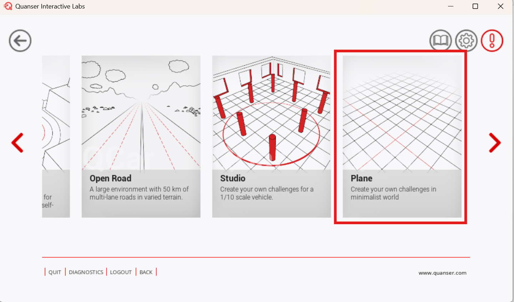

# How to Run the Self Driving Stack 🪧 <!-- omit in toc -->

Everything pertaining to running the `/self_driving_stack_resources` is found here.

## Description <!-- omit in toc -->

Please use the following guide to run the Self Driving Stack after completing the [Virtual Software Setup Guide](./Virtual_MATLAB_Software_Setup.md) or the
[Manual Software Setup Guide](./Virtual_MATLAB_Manual_Software_Setup.md):

- [Running the Self-Driving Stack Resources](#running-the-self-driving-stack-resources)
- [MATLAB Setup Real Scenario](#matlab-setup-real-scenario)
- [Learning the Self-Driving Stack](#learning-the-self-driving-stack)

## Running the Self-Driving Stack Resources

Follow the below instructions to make sure everything is set up correctly and learn how to use the provided resources:

1. Using MATLAB navigate to the `Documents/student-competition-resources-matlab/Virtual_MATLAB_Resources/self_driving_stack_resources` (make sure you double -click on folders and don't expand them)

2. Open QLabs and navigate to `Self-Driving Car Studio` => `Plane`

    

3. Run the `Virtual_Setup_Competition_Map.m` script and select the option `n` when prompted to `Setup real scenario?`

4. Use `run` button to run the model

   

You should see the QCar begin to complete a lap of the outside-most lane as shown below (sped up):

If something is not working correctly, please double-check that you have gone through the steps correctly. If the issue persists, you may raise an issue in the [Issues tab](https://github.com/quanser/student-competition-resources-matlab/issues)

## MATLAB Setup Real Scenario

In the `Setup_QCar2_Params.m` script, you will be prompted to setup the real scenario if it is desired.

A more realistic traffic scenario is provided through the [`Setup_Real_Scenario.m`](../Virtual_MATLAB_Resources/self_driving_stack_resources/Setup_Real_Scenario.m) file. This script spawns signage and traffic lights.

This script runs CONTINUOUSLY in a loop to control the traffic lights. If this scenario is desired selecting `y` in the `Setup_QCar2_Params.m` script will open a MATLAB Command Window to run the script in a separate instance of MATLAB.

## Learning the Self-Driving Stack

Once everything is confirmed and working, you can take a look at the [development guide](./Virtual_MATLAB_Development_Guide.md).
