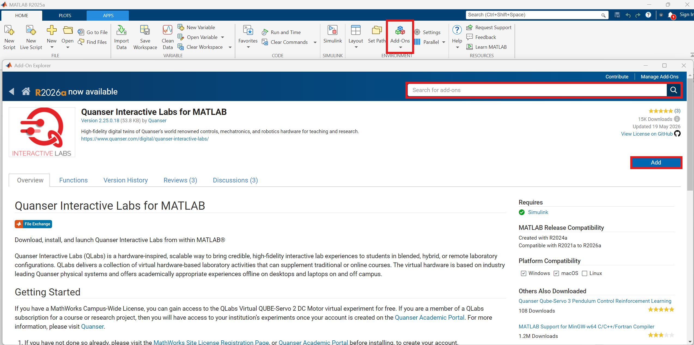
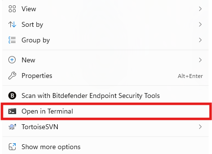

# Manual Setup of Virtual MATLAB Software 🪧 <!-- omit in toc -->

Please go through the following steps to set up a computer with the Quanser Interactive Labs add-ons without using the [Software Setup Script](./Virtual_MATLAB_Software_Setup.md).

## Description <!-- omit in toc -->

This document will cover the following:

- [Setting up Quanser Interactive Labs (QLabs) with MATLAB](#setting-up-quanser-interactive-labs-qlabs-with-matlab)
- [Setting Up the MATLAB Competition Resources](#setting-up-the-matlab-competition-resources)
- [Next Step](#next-step)

## Setting up Quanser Interactive Labs (QLabs) with MATLAB

Follow the below steps to set up QLabs with MATLAB for Virtual ONLY:

>WARNING: Ensure you do not already have QUARC or Quanser Interactive Labs installed on this PC (uninstall them if you do).

1. Register for QLabs on the [Quanser Academic Portal](https://portal.quanser.com/Accounts/Register)

2. Do the following sequence:
    * Open MATLAB
    * Open the Add-Ons Manager
    * Search for Quanser Interactive Labs
    * Select Add
  


3. In the MATLAB Command Window input `QLabs.setup`

## Setting Up the MATLAB Competition Resources

**First**, the Quanser Academic Resources will be installed:

1. Follow the instructions here to download the Quanser Academic Resources: [Quanser Academic Resources Download](https://github.com/quanser/Quanser_Academic_Resources?tab=readme-ov-file#downloading-resources)

2. Run the following batch file with the following guidelines:

    - You are using MATLAB only
    - You are using ONLY Virtual

    `C:\Users\<username>\Documents\Quanser\1_setup\step_1_check_requirements.bat`

3. Run the following batch file:

    `C:\Users\<username>\Documents\Quanser\1_setup\configure_matlab.bat`

These resources will contain all the Quanser Resources for all of Quanser's products, but the [SDCS lab content](https://github.com/quanser/Quanser_Academic_Resources/blob/dev-windows/docs/start_labs.md#sdcs) will be the most relevant.

**Second**, the Github repo containing the student competition resources for MATLAB will be downloaded:

1. Navigate to your Documents folder within a File Explorer window

2. Open a CMD Window in this directory by right-clicking in the blank space and selecting `Open in Terminal`

    

3. Clone the following Github Repo into the Documents folder using the following command:

    ```bash
    git clone https://github.com/quanser/student-competition-resources-matlab.git
    ```

## Next Step

Once everything has been setup correctly, you may proceed with learning about [How to Run the Stack](./Virtual_MATLAB_How_to_Run_the_Stack.md).
