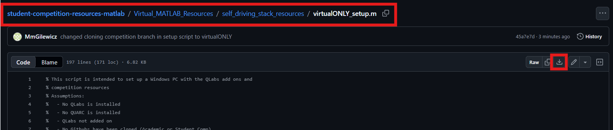

# Virtual MATLAB Software Setup 🪧 <!-- omit in toc -->

Please go through the following steps to set up a computer with the Quanser Interactive Labs add-on to participate in Virtual ONLY competitions.

## Description <!-- omit in toc -->

This document will cover the following:

- [System Requirements](#system-requirements)
- [Setting Up Using the Provided Script](#setting-up-using-the-provided-script)
- [Next Step](#next-step)

## System Requirements

`Installation Time:` It will take around **30** to install everything depending on internet connection

`Storage:`: Installing everything will consume around **3GB of storage**

`OS:` Windows 10 or 11

`MATLAB Version:` 2024a or higher

`MATLAB Toolboxes:` Control Systems Toolbox

`C++ Compiler:` Not Required

`Minimum Hardware:`

- Graphics Card: Intel UHD or Intel Iris Xe integrated GPU, or equivalent
- Processor: Intel Core Ultra 5, Intel Core i5, AMD Ryzen 5, or equivalent
- Memory: 8 GB RAM

`Recommended Hardware:`

- Graphics Card: 4050m or equivalent
- Processor: i5-13500HX or equivalent
- Memory: 16 GB RAM

**Note**: Recommended hardware is based on the hardware used to develop and run self-driving stack in Simulink.

## Setting Up Using the Provided Script

Follow the below steps to perform the automated setup:

1. Download the automated setup script [virtualONLY_setup.m](./self_driving_stack_resources/virtualONLY_setup.m):

2. Open the script in MATLAB
3. Run the script

Once you see `Everything should now be set up for running the Student Competition Resources!` the script has completed. Please monitor the output to the Command Window in MATLAB as this will tell you if there were any issues along the way.

## Next Step

Once everything has been setup correctly according to the script, you may proceed with learning about [How to Run the Stack](./Virtual_MATLAB_How_to_Run_the_Stack.md)
